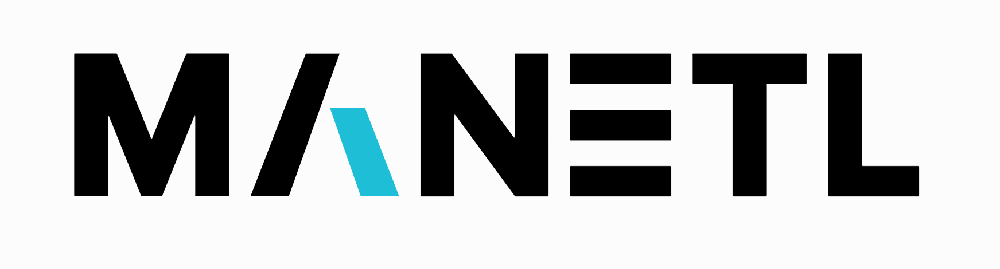
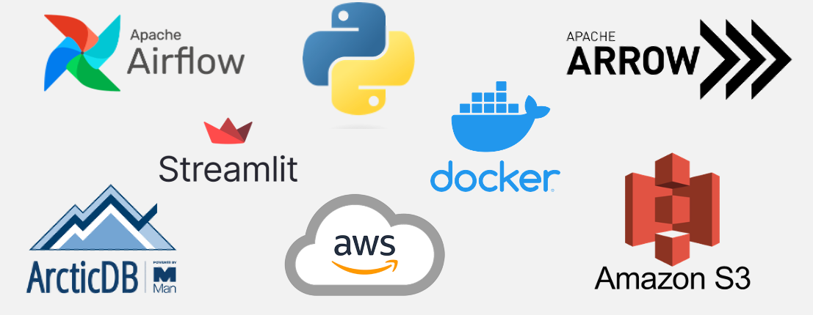
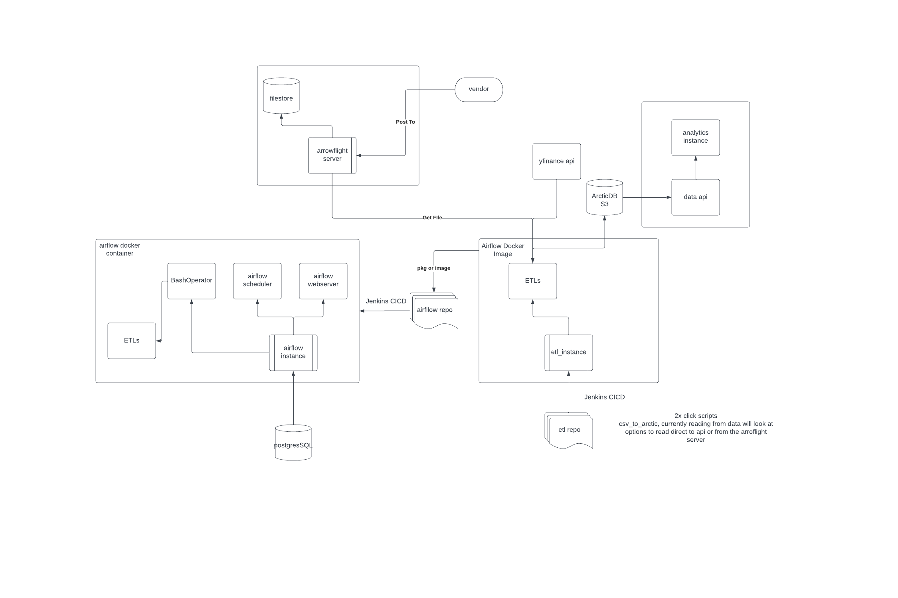

# ManETL: Your Data Engineering Solution 🌐🔀💽

ManETL is a versatile data engineering platform developed by a dedicated group of part-time students at Man Group. Designed with flexibility, scalability, and efficiency in mind, ManETL ensures seamless extraction, transformation, and loading (ETL) of your vendor data. 

## Tech Stack Used 🛠️

## Why ManETL? 🚀
With ManETL, your data journeys through our meticulously engineered and customizable pipelines. Each pipeline focuses on extracting vendor data, transforming it based on your unique requirements, and finally loading it into a Pyarrow server for efficient and in-depth analysis. 

ManETL is more than just an ETL platform. It's a solution designed for data professionals seeking to streamline their data workflow and enhance their analytical capabilities.

## Features 🎯

* **Customizable Pipelines:** ManETL isn't a one-size-fits-all solution. We understand that each project has unique data requirements, which is why our pipelines are fully customizable.

* **Efficient Data Processing:** Our platform is designed to handle large volumes of vendor data, ensuring that your data is processed efficiently and made readily available for analysis.

* **Pyarrow Server Integration:** ManETL seamlessly integrates with Pyarrow Server, making your transformed data instantly available for comprehensive analysis.

## Architecture 🏗️

## Getting Started 🚦

1. **Clone the repo:**  
`git clone https://github.com/mazalkov/WM9L8-IMA.git`

2. **Navigate to the project directory:**  
`cd ManETL`

3. **Install the requirements:**  
`pip install -r requirements.txt`

4. **Set up your configuration:**  
Develop `setup.py` as per your requirements.

5. **Run the project:**  
`docker run {args}` (this will run the Streamlit app as well)

## About Us 👥
ManETL is a project by a group of dedicated part-time students working at Man Group. We're passionate about data, and we aim to make data engineering more accessible and efficient for everyone.

Happy Data Engineering with ManETL! 🎉📊
